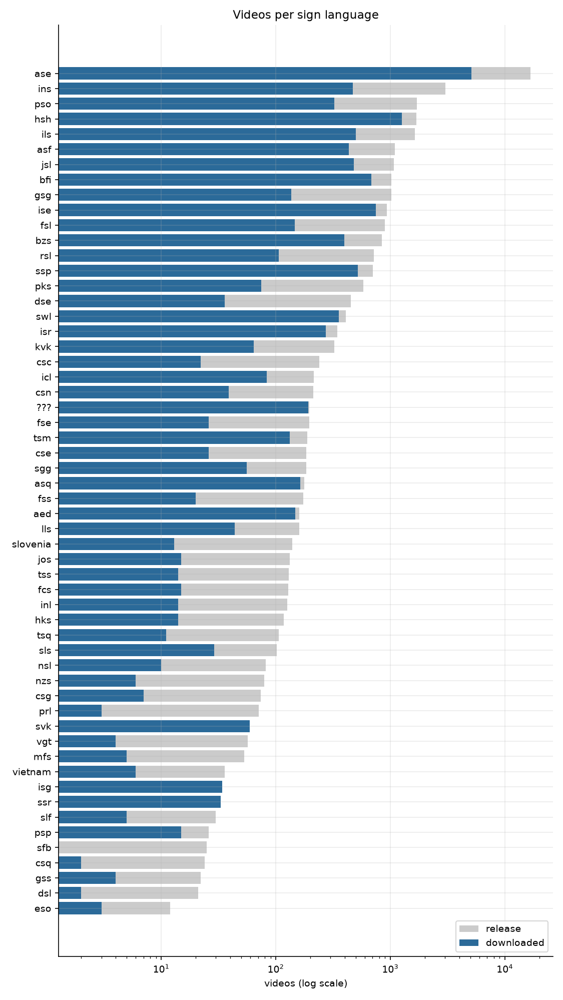
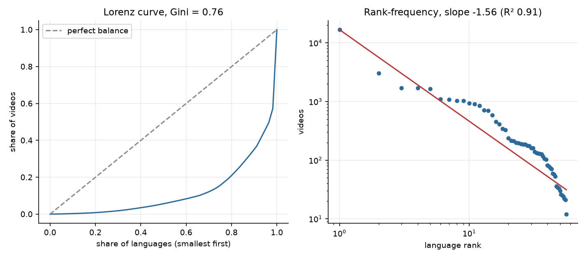
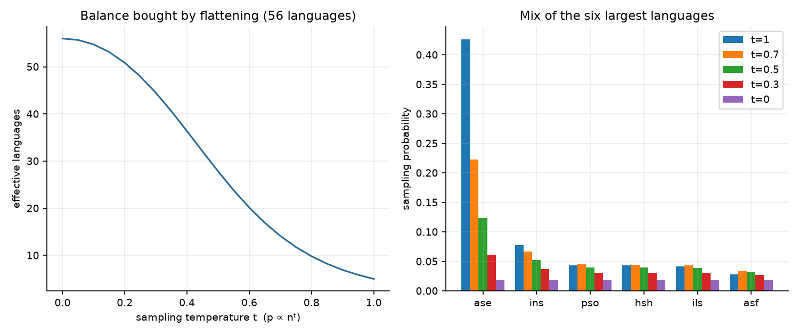
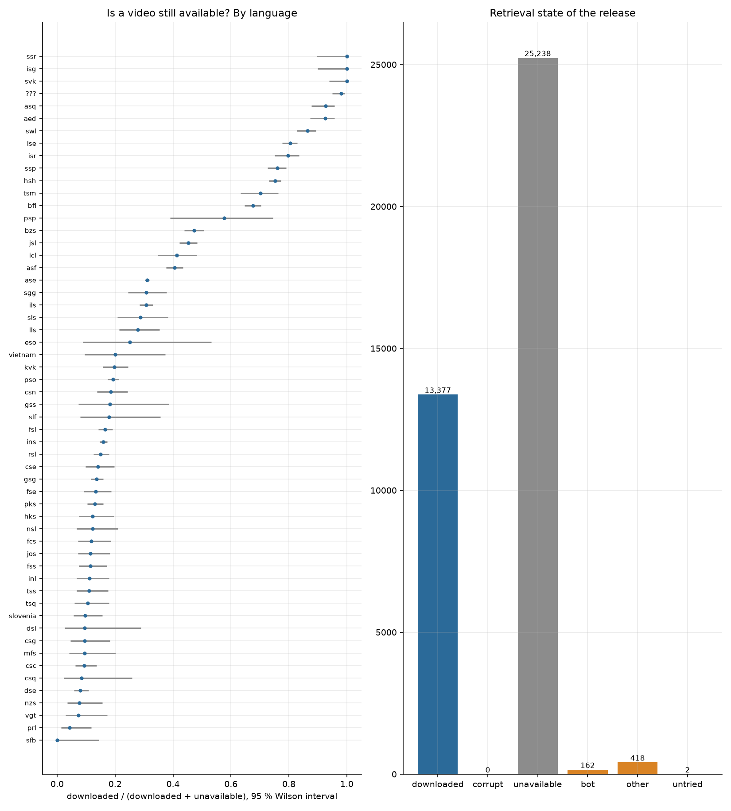
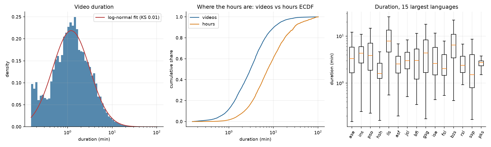
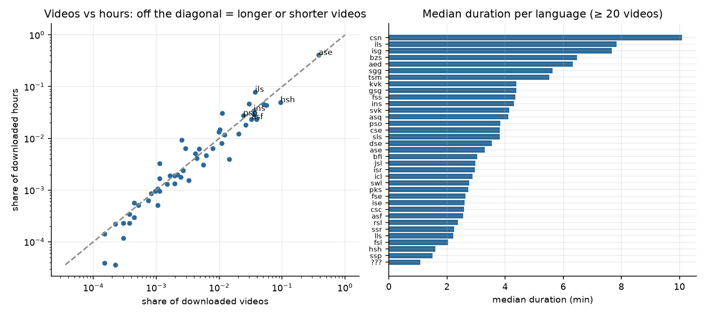
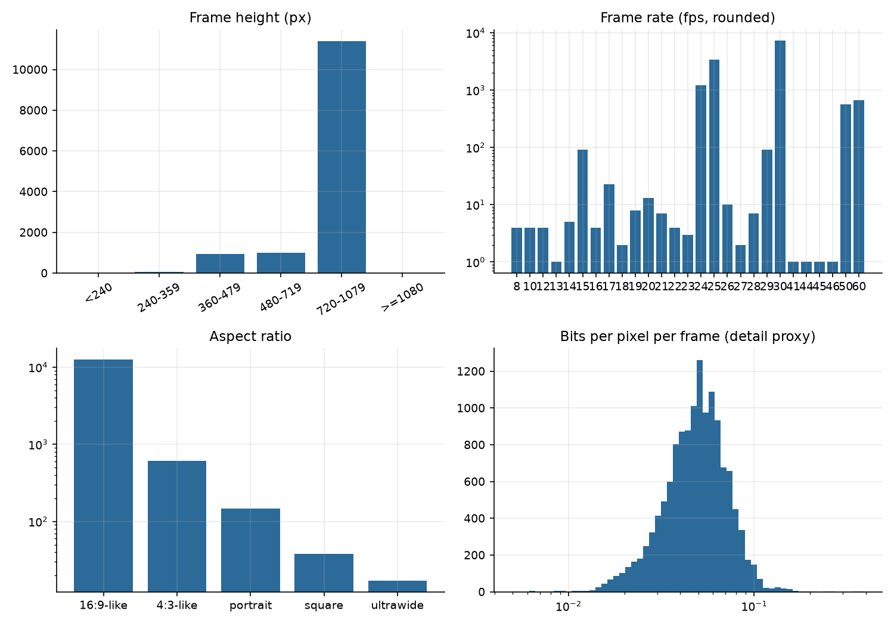
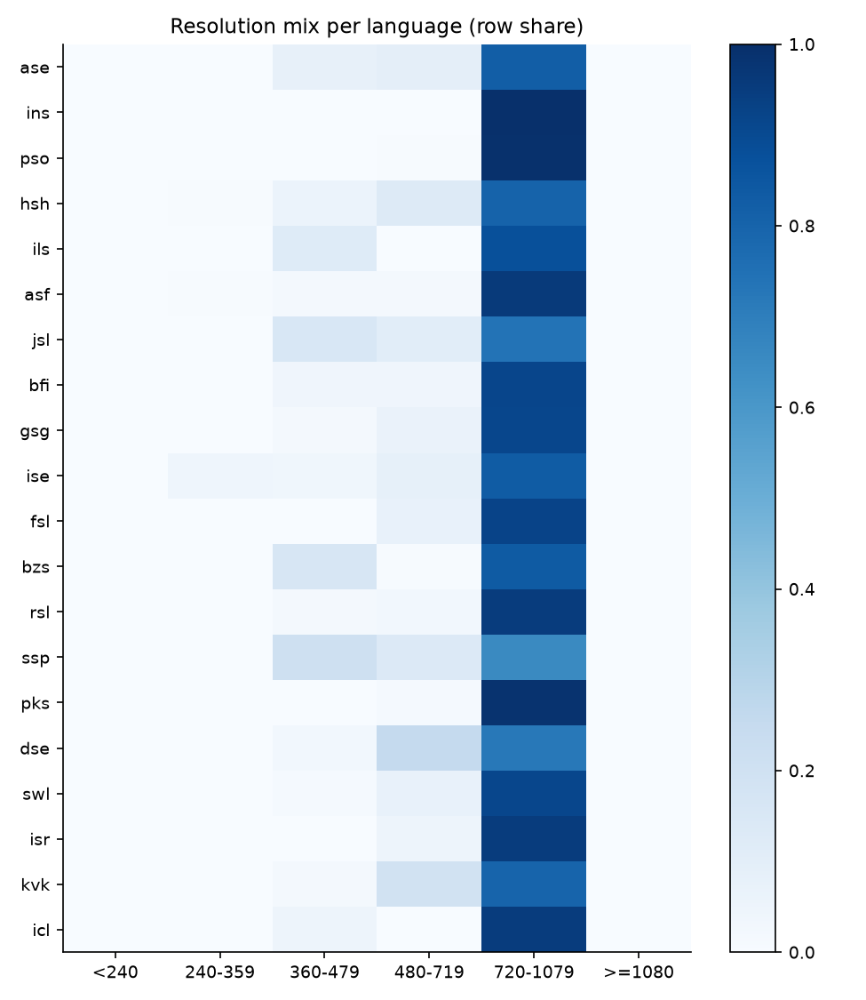
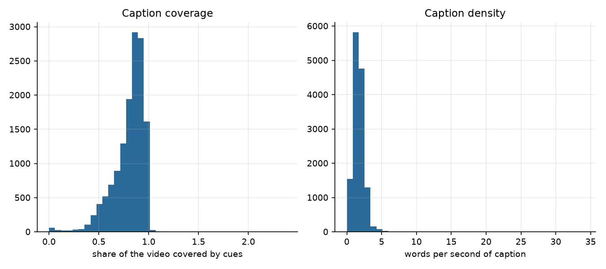

# YouTube-SL-25: stato dei dati scaricati, integrità, testo e split

**Data:** 10/10/2026. **Cosa descrive:** il sottoinsieme di YouTube-SL-25 effettivamente presente su disco (`~/dataset/youtube-sl-25`), non il rilascio completo. Codice: `signworld/data/analysis/youtube_sl25*.py`; risultati grezzi, tabelle e figure in `reports/youtube_sl25/` (`report.md` per le figure, `integrity.json`, `text_and_splits.json`, `splits_proposal.csv`).

## 1. Cosa abbiamo

| | Valore |
|---|---|
| ID nel rilascio | 39.197 (tutti unici, 56 lingue dei segni) |
| Video scaricati e validi | **13.377 (34,1 %)**, 1.074 ore, 525 GB |
| Video con metadati (`info/*.json`) | 12.097 |
| Video con almeno una traccia di sottotitoli | 12.096 |
| Video con la traccia nella propria lingua | 11.550 |
| ID non scaricati | 25.820: 25.238 «non disponibili», 162 blocchi bot, 418 altro, 2 mai provati |

**Il download dei video si è fermato per un rate-limit di YouTube**, e l'ho fermato io su tua richiesta. Le liste `failed_*.txt` vengono riscritte a ogni run, e con il rate-limit attivo molti video riprovabili finiscono tra i «non disponibili»: tre passaggi dei soli sottotitoli sui video già scaricati hanno recuperato 1.821 + 990 video che i passaggi precedenti avevano dato per persi. Il 64,4 % di «non disponibili» **non è quindi una misura della disponibilità reale**: è un limite superiore, da rimisurare con un download pulito.

**Pendenti.** 1.280 video scaricati non hanno ancora metadati né testo (il rate-limit è tornato durante il terzo passaggio dei sottotitoli): vanno ritentati più tardi con `uv run download_subtitles.py` (riprende da soli quelli senza `info/<id>.json`).

## 2. Controlli di integrità

Script: `python -m signworld.data.analysis.youtube_sl25_integrity` (sola lettura; con `--quarantine` sposta i file inutilizzabili senza cancellarli). Esito sul disco al 10/10:

| Controllo | Esito |
|---|---|
| ID duplicati nel CSV del rilascio | **0** |
| Video con più contenitori (stesso ID, `.mp4` e `.webm`) | 0 |
| Video fuori dal rilascio | 0 |
| File temporanei (`.part`, `.ytdl`, `.fNNN`) | 0 |
| Video illeggibili per ffprobe, di dimensione zero, senza video o senza audio | **0** |
| Sottotitoli vuoti | 0 |
| Sottotitoli senza video corrispondente | 0 |
| **Video senza testo** | **1.281** (1.280 senza metadati, 1 con metadati ma senza traccia) |
| Coppie video + testo | **12.092** |
| Durata nel file `info` diversa da quella del file di oltre 2 s | 4 (`uu1FvPlZnG8`: 124 s dichiarati, 144,6 s nel file) |
| Sottotitoli illeggibili (caratteri di sostituzione) | 4 |
| Sottotitoli con cue oltre la fine del video (più di 5 s) | 43 |
| **Video identici (stesso contenuto)** | **2 coppie**: `-urXXDI0OiE`/`z3thwypVsjw`, `EMqOLXi0nmw`/`XH6nn3kH4d4` |
| Video diversi con sottotitoli identici | 46 gruppi (36 sulla sola traccia usata per le clip, 73 video) |
| Video con frequenza di fotogrammi anomala (< 10 fps) | 7 |
| **Video che decord non apre** (il lettore del training) | **174, tutti AV1** (1,3 %) |

**Cosa ne segue.**
1. **Duplicati.** Le 2 coppie di video identici e i gruppi con testo identico sono ricaricamenti: non li ho cancellati. Vanno tenuti nello stesso split (lo fa la proposta di §4) e, per l'addestramento, scartati tranne uno per gruppo.
2. **AV1.** Sono 174 video (10.172 clip, il 1,8 % delle clip). ffprobe li dà per validi, ma decord no: in training darebbero errore o clip vuote. Due strade: ri-codificarli in H.264 con ffmpeg, oppure riscaricarli con `-S vcodec:h264`. Finché non si fa, vanno esclusi (la stima di §3 li esclude già).
3. **Durata.** `uu1FvPlZnG8` (20 s di differenza) e gli altri 3 vanno guardati a mano: file troncato o video sbagliato.
4. **Coppie video + testo.** La regola «per ogni video un testo» **non è ancora soddisfatta**: mancano i 1.281 di cui sopra. Esiste un'eccezione legittima, 546 video con tracce ma nessuna nella propria lingua (tradotte soltanto), che restano utilizzabili solo per il livello fisico (§3.3 del progetto).
5. **Tracce multiple.** 11.286 video hanno una traccia, 810 ne hanno da 2 a 61 (traduzioni e varianti `en-XXXX`). Il progetto tiene la sola traccia nella lingua propria (`own_language_track`).

## 3. Analisi dei dati

### 3.1 Video

- **1.074 ore** in 13.377 video: mediana 3,1 min, media 4,8 min, 95° percentile 14,5 min. L'1 % dei video più lunghi vale il 9 % delle ore, il 10 % ne vale il 39 %.
- **Risoluzione**: 720p per 11.386 video (85 %), il resto inferiore; il downloader limita a 720p. Codec: H.264 12.967, VP9 236, AV1 174.
- **Lingue**: `ase` (ASL) è il **42,7 % del rilascio** e il 38,1 % dei video scaricati; Gini sui video per lingua 0,76, equivalenti a 5,0 lingue ugualmente frequenti su 56; 17 lingue hanno meno di 100 video nel rilascio. Il progetto non ribilancia (§3.5): conta che le metriche medie descrivono soprattutto ASL e vanno riportate **anche per lingua**.
- **Bias di recupero**: la disponibilità dipende dalla lingua (chi² p < 1e-10, Cramér V 0,43; scostamento totale del mix di lingue 0,21), ma questo numero è inquinato dal rate-limit (§1). Da rimisurare.
- Ore stimate sull'intero rilascio: 3.299 contro le 3.200 dichiarate.

### 3.2 Testo

Le clip seguono `corpus.builders.YouTubeSL25Manifest`: **una clip per cue** della traccia nella lingua propria.

| | Valore |
|---|---|
| Clip (cue) | **573.822** in 11.550 video, 785 ore di tempo coperto dalle cue |
| Clip per video | mediana 28, media 50, 95° percentile 150, massimo 2.415 |
| Durata di una clip | mediana 4,1 s, 5°–95° percentile 1,2–11,1 s, massimo 605 s |
| Parole per clip | mediana 8, 95° percentile 17 (4,8 milioni di parole in tutto) |
| Cue sul tempo del video | mediana 85 %: le didascalie coprono quasi tutto il video |
| Clip più brevi di 1 s | 17.591 (3,1 %); più lunghe di 20 s: 3.048 (0,5 %) |
| Annotazioni non parlate (`[Music]`, `♪`) | 2.930 |
| Clip di una sola parola | 41.093 (7,2 %) |
| Clip che si sovrappongono alla successiva | 2.603 |
| Clip con testo ripetuto nello stesso video | 15.834 (2,8 %) |
| Clip con stesso testo e stessi tempi in altri video | 6.610 (ricaricamenti) |
| Clip oltre la fine del video | 524 |

**Clip utilizzabili** (durata 1–20 s, non annotazioni, video non AV1): **540.290, pari a 743,5 ore**. Per split proposti: train 433.820 (601,4 h), validation 60.334 (89,3 h), test 46.136 (52,8 h). È il **25 %** delle 2,16 milioni di coppie clip–testo che il progetto stima per il rilascio intero (§3.2 del progetto).

Avvertenze sul testo:
- **Le parole non misurano il testo per le lingue senza spazi.** Il giapponese (`jsl`: 19.432 clip e 25.341 parole, 1,3 per clip) va misurato in caratteri.
- **L'allineamento non è misurabile da qui.** Le cue sono tempi di sottotitolo, non tempi del segnato: in BOBSL il segnato arriva in media 2,7 s dopo (§3.3 del progetto). Con clip mediane di 4 s è un errore dello stesso ordine della clip. Va misurato sul dry run (PC7), non dal disco.
- **Le traduzioni sono rumorose** e alcune tracce sono marcate col codice della lingua dei segni (689 video per `ase`, in inglese).

### 3.3 Per lingua (le prime)

| Lingua | Video con testo | Clip | Ore di cue | Canali | Canale più grande |
|---|---|---|---|---|---|
| `ase` | 4.536 | 262.843 | 321 | 1.421 | 4 % |
| `ils` | 456 | 36.916 | 65 | 10 | **95 %** |
| `bfi` | 633 | 27.323 | 40 | 44 | 35 % |
| `ise` | 682 | 24.824 | 36 | 20 | 14 % |
| `hsh` | 1.157 | 24.765 | 42 | 9 | **81 %** |
| `bzs` | 359 | 24.273 | 36 | 26 | 14 % |
| `jsl` | 430 | 19.432 | 22 | 20 | 15 % |
| `pso` | 295 | 17.142 | 24 | 27 | 33 % |

### 3.4 Figure e come leggerle

Le figure sono in `reports/youtube_sl25/` (generate da `youtube_sl25_report`). I codici sono ISO 639-3 (`ase` = ASL, `ils` = lingua dei segni internazionale, `hsh` = ungherese, ecc.). Tutte descrivono i **13.377 video scaricati** o il rilascio di 39.197 ID, non le clip.

#### Figura 1: video per lingua, rilascio contro scaricato



**Cosa mostra.** Per ogni lingua, una barra grigia (video nel rilascio) e una blu (video scaricati), su **scala logaritmica**, ordinate per dimensione.

**Come leggerla.** La parte grigia visibile oltre il blu è quello che non abbiamo. Sulla scala log un tratto di grigio apparentemente piccolo in alto vale migliaia di video (`ase`: 16.724 nel rilascio, 5.096 scaricati). Dove il blu copre il grigio (`svk`, `isg`, `ssr`, `asq`, `aed`) abbiamo quasi tutto; `sfb` non ha nessun video scaricato.

**Cosa ne segue.** Il sottoinsieme non è una copia ridotta del rilascio: alcune lingue sono molto più complete di altre (`hsh`, `ise`, `swl`, `isr`, `ssp` quasi complete; `gsg`, `fsl`, `rsl`, `pks` sotto il 20 %). Compaiono anche codici da normalizzare (`slovenia`, `vietnam`) e `???` (197 video con lingua ignota).

#### Figura 2: quanto è sbilanciato il corpus



**Cosa mostra.** A sinistra la curva di Lorenz: in ascissa la quota di lingue (dalla più piccola), in ordinata la quota cumulata di video. A destra il grafico rango-frequenza (log-log): ogni punto è una lingua, in ascissa la posizione per numerosità, in ordinata i video; la retta rossa è l'adattamento a una legge di potenza.

**Come leggerla.** Con un corpus perfettamente bilanciato la curva sarebbe la diagonale tratteggiata; più è lontana, più è sbilanciato. L'area tra le due è il **Gini (0,76)**. Qui l'80 % delle lingue più piccole contiene circa il 20 % dei video, e l'ultimo tratto della curva, quasi verticale, è `ase` (42,7 %). A destra, una pendenza di −1,56 indica una coda pesante; la retta spiega bene il grosso (R² 0,91) ma i dati si discostano: la fascia centrale (rango 6–35) sta sopra la retta e le ultime lingue cadono sotto, cioè la coda è più corta di una legge di potenza pura.

**Cosa ne segue.** Una media sul corpus intero descrive soprattutto ASL e le prime cinque lingue (63,2 % dei video). Le metriche vanno riportate **per lingua**, non solo in media.

#### Figura 3: cosa cambia ribilanciando con la temperatura



**Cosa mostra.** Se si campiona una lingua con probabilità `p ∝ nᵗ` (n = video della lingua, t = temperatura), a sinistra quante «lingue effettive» (inverso dell'indice di Simpson) ottengo al variare di t; a destra come cambia la probabilità delle sei lingue maggiori.

**Come leggerla.** t = 1 è il campionamento proporzionale ai dati (5,0 lingue effettive, `ase` al 42,7 %); t = 0 è uniforme (56 lingue effettive, 1,8 % ciascuna). Valori intermedi: t = 0,7 dà 14,1 lingue e `ase` al 22,2 %; t = 0,5 dà 27,8 e 12,4 %; t = 0,3 dà 44,5 e 6,2 %.

**Cosa ne segue.** Abbassare t dà più peso alle lingue piccole, ma le fa ripetere molte volte (rischio di memorizzazione di pochi video). È un compromesso da scegliere: il progetto, per ora, non ribilancia (§3.5), ma la figura dice quanto costerebbe farlo.

#### Figura 4: cosa è stato recuperato e con che bias



**Cosa mostra.** A sinistra, per ogni lingua, la frazione `scaricati / (scaricati + non disponibili)` con il suo intervallo di confidenza di Wilson al 95 %. A destra, il conteggio degli ID per esito (scaricato 13.377, non disponibile 25.238, bot 162, altro 418, mai provato 2).

**Come leggerla.** Il punto è la stima, la barra l'incertezza: le barre lunghe sono lingue con pochi video. Se la disponibilità non dipendesse dalla lingua, tutti i punti starebbero intorno alla stessa frazione; invece vanno da 1,0 (`ssr`, `isg`, `svk`) a 0 (`sfb`), con `ase` intorno a 0,31. È l'effetto che il test chi² misura (p < 1e-10, Cramér V 0,43, scostamento totale del mix 0,21).

**Cosa ne segue e cautela.** Il sottoinsieme non rappresenta il rilascio. Ma il 64,4 % di «non disponibili» è inquinato dal rate-limit di YouTube (§1): è un limite superiore, e il bias va **rimisurato dopo un download pulito**, non usato così com'è.

#### Figura 5: durate dei video



**Cosa mostra.** A sinistra la distribuzione delle durate (asse x logaritmico) con l'adattamento log-normale (KS 0,01); al centro le curve cumulative della quota di **video** e della quota di **ore** in funzione della durata; a destra i boxplot (scatola = quartili, riga arancione = mediana) per le 15 lingue maggiori, in scala log.

**Come leggerla.** Il log-normale descrive bene il corpo (KS basso, mediana 3,1 min), ma c'è un eccesso di video molto brevi (sotto ~0,3 min) che la curva non spiega. Al centro, la curva delle ore sta a destra di quella dei video: metà dei video dura meno di circa 3 minuti, ma servono video fino a circa 7 minuti per arrivare a metà delle ore; l'1 % dei video più lunghi vale il 9 % delle ore, il 10 % ne vale il 39 %. A destra, la durata dipende dalla lingua (Kruskal-Wallis ε² 0,14): `ils` ha mediana alta, `hsh` e `ssp` bassa.

**Cosa ne segue.** Pochi video lunghi pesano molto in ore: campionare per video e per ore dà mix diversi. I video brevissimi vanno controllati.

#### Figura 6: video contro ore, e durata mediana per lingua



**Cosa mostra.** A sinistra, per lingua, la quota di video scaricati (asse x) contro la quota di ore (asse y), in log-log. A destra la durata mediana per le lingue con almeno 20 video.

**Come leggerla.** Un punto sulla diagonale ha ore in proporzione ai video; **sopra** la diagonale i video sono più lunghi della media (`ils`: circa il 4 % dei video ma l'8 % delle ore), **sotto** più corti (`hsh`: circa il 9 % dei video e il 5 % delle ore). A destra le mediane vanno da circa 10 min (`csn`) a poco più di 1 (`???`, `ssp`, `hsh`).

**Cosa ne segue.** «Quanti dati ha una lingua» dipende dall'unità: per `ils` le ore sono il doppio di quanto suggerisce il numero di video, per `hsh` circa la metà. Per decisioni sul mix (§3.5) conviene ragionare in **ore o clip**, non in video.

#### Figura 7: qualità tecnica



**Cosa mostra.** Quattro istogrammi sui video scaricati: altezza del fotogramma, frame rate, rapporto d'aspetto, bit per pixel per fotogramma (proxy del dettaglio). Frame rate e rapporto d'aspetto hanno l'asse y in scala log.

**Come leggerla.** L'altezza è troncata a 720p dal downloader (11.386 video a 720–1079, 85 %), quindi non dice nulla sulle risoluzioni originali superiori. Il frame rate è **misto**: 30 fps (circa 7.000 video), 25 (circa 3.400), 24 (circa 1.200), 50 e 60 (circa 600 ciascuno) e una coda di valori rari, 7 video sotto i 10 fps. Il rapporto d'aspetto è quasi sempre 16:9 (circa 12.000), poi 4:3, verticale, quadrato, ultralargo. I bit per pixel hanno una campana intorno a 0,05: la coda sinistra sono video molto compressi (mani sfocate), la destra video ricchi di dettaglio.

**Cosa ne segue.** Serve un ricampionamento a frame rate fisso e una regola di ritaglio coerente per i formati non 16:9 (un ritaglio centrale su video verticali o 4:3 può tagliare le mani). I bit per pixel sono solo un'approssimazione: non misurano la qualità né la visibilità delle mani.

#### Figura 8: risoluzione per lingua



**Cosa mostra.** Una matrice: ogni riga è una lingua (le 20 maggiori), ogni colonna una classe di altezza, il colore è la quota dei video della lingua in quella classe (ogni riga somma a 1).

**Come leggerla.** Quasi tutto è nella colonna 720–1079 (colore scuro). Le righe più chiare in quella colonna hanno risoluzioni più basse: `ssp` ha circa il 60 % a 720p e il resto a 360–719; `dse` e `jsl` hanno una quota evidente a 480–719 o 360–479; `ins`, `pso`, `pks`, `isr`, `icl` sono quasi tutte a 720p.

**Cosa ne segue.** La risoluzione è **correlata con la lingua** (in pratica con i canali di origine): un modello potrebbe imparare la qualità dell'immagine come scorciatoia per riconoscere la lingua. Va controllato nelle valutazioni per lingua e, se serve, compensato con augmentation di qualità.

#### Figura 9: didascalie



**Cosa mostra.** A sinistra la copertura (quota della durata del video coperta da cue di sottotitolo); a destra la densità (parole per secondo di didascalia).

**Come leggerla.** La copertura ha il picco intorno a 0,85–0,9 (mediana 84 %): quasi sempre una parte del video resta senza testo, con una coda verso lo zero (tracce quasi vuote). Valori leggermente sopra 1 indicano cue che superano la fine del video (43 casi oltre 5 s, §2). La densità ha picco tra 1 e 2 parole al secondo (mediana 1,64); i valori sopra 5 sono rari e vanno ispezionati.

**Cosa ne segue.** Queste figure dicono **quanto** testo c'è, non se è **allineato** al segnato: le cue sono tempi di sottotitolo, non del segnato (§3.2). Per le lingue senza spazi (`jsl`) le parole al secondo non sono una misura valida: servono i caratteri.

## 4. Gli split

**Il dataset non ha split predefiniti.** Il CSV del rilascio ha solo `video_id,language`, e il README e il paper non ne definiscono: YouTube-SL-25 è un corpus di pre-addestramento, i risultati si riportano su benchmark esterni. Va quindi definito da noi, ed è una decisione scientifica: il progetto l'ha già fissata (§3.4: **per canale, mai per clip**; validation held-out-channel e held-out-language).

### 4.1 Com'è fatto il corpus rispetto a quel vincolo

- **1.828 canali** per 12.097 video: mediana **1 video per canale**, 1.067 canali (58 %) con un solo video, media 6,6, massimo 935. Gini 0,76. I 10 canali maggiori valgono il 23,7 % dei video, l'1 % dei canali il 31 %.
- **Concentrazione per lingua**: `ase` ha 1.421 canali e nessuno pesa più del 4 %; le altre lingue ne hanno pochissimi. **`ils` ha 10 canali ma uno solo pesa il 95 %; `hsh` ne ha 9 e uno pesa l'81 %.** Per queste lingue «held-out channel» e «held-out language» coincidono di fatto: non c'è un secondo canale su cui validare.
- 15 canali pubblicano in più di una lingua dei segni.
- Date di caricamento 2008–2024, con il picco nel 2020 (1.909 video).
- **Perché per canale**: con uno split casuale per video, **1.127 dei 1.247 video di validation (90 %) condividono il canale con il train**, cioè stesso segnante, stesso sfondo, stessa luce.

### 4.2 La proposta (`reports/youtube_sl25/splits_proposal.csv`)

Deterministica (hash SHA-256 del canale con sale per lingua: stabile se arrivano nuovi video):

1. train / validation / test = 80 / 10 / 10 **per canale**, stratificato per lingua;
2. i canali legati da un duplicato (stesso file o stesso testo) sono fusi e vanno insieme (9 gruppi);
3. una lingua con meno di 10 canali (dopo la fusione) è solo train: 42 etichette di lingua, tra cui `???`, `slovenia` e `vietnam` che andrebbero prima normalizzate;
4. i video senza metadati (1.280) non hanno canale: **non assegnati**, fuori da ogni split finché non si recuperano.

| Split | Video | Canali | Clip utilizzabili | Ore | Lingue |
|---|---|---|---|---|---|
| train | 10.278 | 1.490 | 433.820 | 601 | 55 |
| validation | 1.064 | 154 | 60.334 | 89 | 11 |
| test | 755 | 184 | 46.136 | 53 | 10 |
| non assegnati | 1.280 | n/d | 0 | n/d | 45 |

**Limiti da tenere presenti.**
- Validation e test coprono **solo 12 lingue**, e il 57 % dei video di validation è `ase`. Dice come generalizza a canali nuovi, non a lingue nuove.
- Il 10 % dei **canali** non è il 10 % dei **dati** (validation 12 %, test 8 % delle clip): con canali di dimensioni così diverse la quota si ottiene solo in media.
- `held_out_languages` (§3.4) non è definibile da questi dati senza scegliere: tenere fuori `ils` o `hsh` toglie il 95 % o l'81 % dei loro dati, ed è una scelta di progetto, non statistica.
- La validation «canali visti» (`seen_video_fraction: 0.02`) si estrae dal train e non è nella proposta.

### 4.3 Come procedere

1. **Terminare il recupero**: ritentare i 1.280 video senza metadati dopo il periodo di rate-limit, poi i 25.820 ID non scaricati con un cookie valido e il downloader con pause (con `-t sleep`, come suggerisce yt-dlp). Rieseguire integrità, report e split: la proposta è deterministica, cambiano solo le assegnazioni dei canali nuovi.
2. **Sistemare i 174 AV1** (ri-codifica o ri-download in H.264) e **deduplicare** (2 coppie di video, 36 gruppi di testo).
3. **Congelare** l'elenco degli ID e `splits_proposal.csv` (il progetto lo richiede, §3.9): da quel momento non si ricalcola.
4. **Decidere i due punti aperti**: soglia di canali per tenere fuori una lingua (ora 10), e se tenere un held-out language (e quale).
5. **Audit di contaminazione con OpenASL** (P2): `ase` condivide i due canali maggiori con OpenASL. Prima di usare `ase` come validation, rimuovere dal corpus i segmenti sovrapposti a clip di test di OpenASL; non l'ho fatto qui, richiede il manifest di OpenASL.
6. **Misurare l'allineamento** testo–segnato su un campione prima di fidarsi delle 540 mila clip come coppie (PC7).

## 5. Come si rifà

```bash
python -m signworld.data.analysis.youtube_sl25_integrity --root ~/dataset/youtube-sl-25 --out reports/youtube_sl25
python -m signworld.data.analysis.youtube_sl25_report    --root ~/dataset/youtube-sl-25 --out reports/youtube_sl25 --reuse-probe
python -m signworld.data.analysis.youtube_sl25_text      --root ~/dataset/youtube-sl-25 --out reports/youtube_sl25
```

Il report richiede `matplotlib` e `scipy`, che non sono dipendenze di `pyproject.toml`. Il controllo di decodifica con decord (174 AV1) non è nello script di integrità: è stato eseguito a parte e il risultato è in `reports/youtube_sl25/decode_check.json`.
